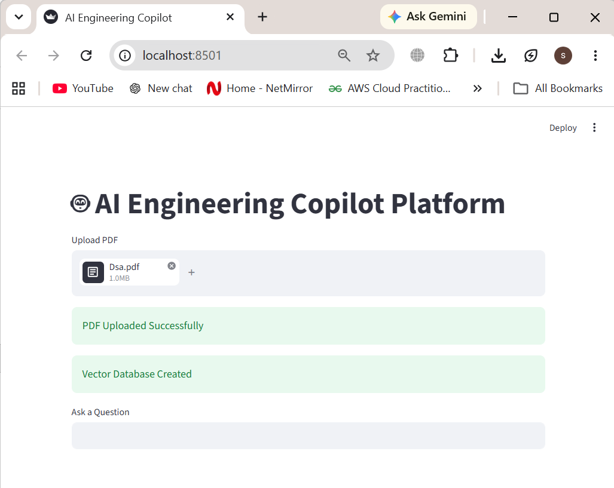
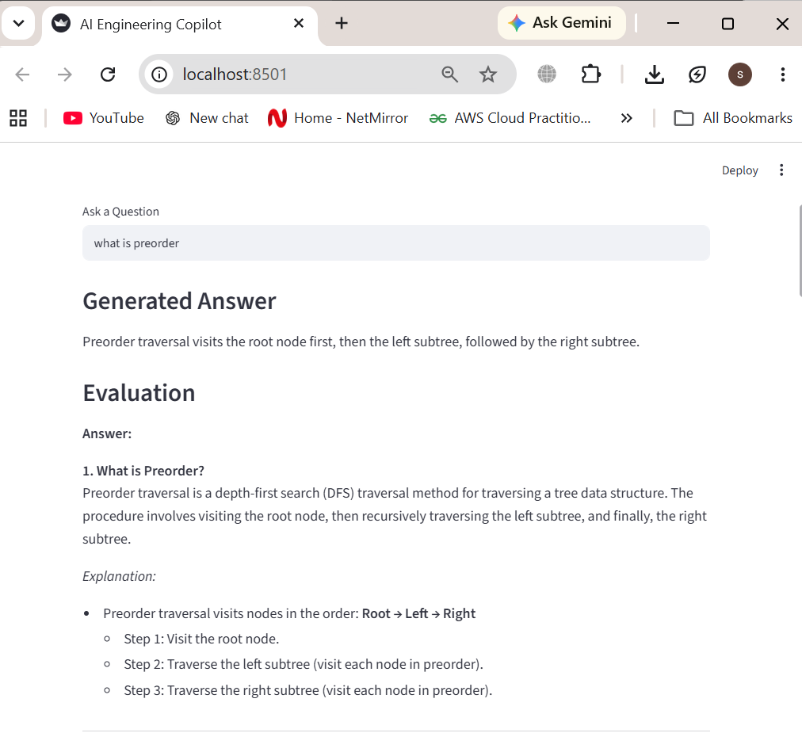
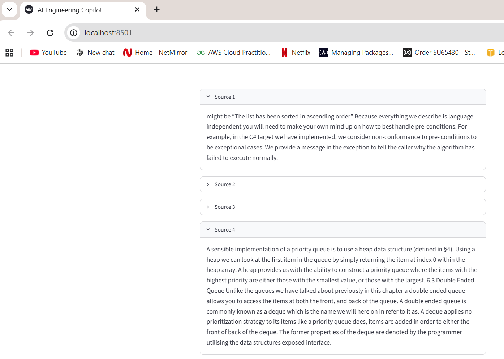
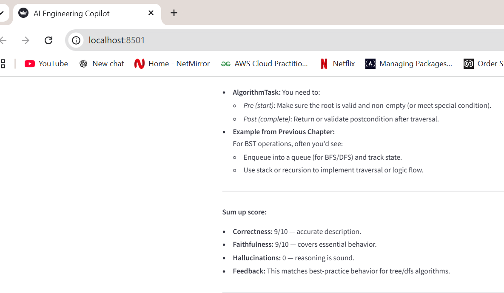

# AI Engineering Copilot Platform

## Overview

AI Engineering Copilot Platform is a Retrieval-Augmented Generation (RAG) application that enables users to upload PDF documents, ask natural language questions, retrieve relevant information using vector search, generate context-aware answers using Large Language Models (LLMs), and evaluate answer quality through faithfulness and hallucination analysis.

The project demonstrates key Generative AI concepts including document ingestion, semantic search, vector databases, prompt engineering, answer generation, and evaluation.

---

## Features

### PDF Upload

* Upload custom PDF documents
* Automatic document processing
* Dynamic knowledge base creation

### Document Processing

* PDF parsing using LangChain
* Text chunking using Recursive Character Text Splitter
* Embedding generation using Hugging Face models

### Vector Search

* FAISS Vector Database
* Semantic similarity retrieval
* Context-aware document search

### Answer Generation

* OpenRouter LLM Integration
* Context-grounded responses
* Retrieval-Augmented Generation (RAG)

### Evaluation Framework

* Correctness Scoring
* Faithfulness Evaluation
* Hallucination Detection
* Automated Feedback Generation

### Explainability

* Source Citations
* Retrieved Context Display
* Transparent Answer Generation

---

## Architecture

```text
User Uploads PDF
        ↓
Document Processing (Load → Chunk → Embed)
        ↓
FAISS Vector Database
        ↓
Semantic Retrieval
        ↓
LLM Answer Generation
        ↓
Answer Evaluation
(Correctness, Faithfulness, Hallucination Detection)
        ↓
Source-Cited Response
```

---

## Tech Stack

### Programming Language

* Python

### Frameworks & Libraries

* LangChain
* Streamlit
* FAISS
* Hugging Face Embeddings
* OpenRouter API
* Python Dotenv

### AI Components

* Retrieval-Augmented Generation (RAG)
* Semantic Search
* Vector Databases
* LLM Evaluation
* Prompt Engineering

---

## Project Structure

```text
AI_Engineering_Copilot/

├── app.py
├── copilot.py
├── rag.py
├── retriever.py
├── evaluator.py
├── requirements.txt
├── README.md
├── .gitignore
├── uploads/
├── vectorstore/
└── screenshots/
```

---

## Screenshots

### Home Screen



### Answer Generation



### Evaluation and Source Citations




---

## Installation

Clone the repository:

```bash
git clone https://github.com/helisara1/AI-Engineering-Copilot-Platform.git
```

Move into the project folder:

```bash
cd AI-Engineering-Copilot-Platform
```

Create virtual environment:

```bash
python -m venv venv
```

Activate virtual environment:

Windows:

```bash
venv\Scripts\activate
```

Install dependencies:

```bash
pip install -r requirements.txt
```

---

## Environment Variables

Create a `.env` file:

```env
OPENROUTER_API_KEY=YOUR_API_KEY
```

---

## Run Application

```bash
streamlit run app.py
```

Open:

```text
http://localhost:8501
```

---

## Resume Highlights

* Developed a Retrieval-Augmented Generation (RAG) platform for querying PDF documents using semantic search and vector embeddings.
* Built an end-to-end pipeline for PDF ingestion, chunking, embedding generation, FAISS vector storage, and context-aware answer generation.
* Implemented automated answer evaluation for correctness, faithfulness, and hallucination detection.
* Designed an interactive Streamlit application supporting PDF upload, source-cited responses, and explainable AI outputs.
* Integrated Hugging Face embeddings and OpenRouter LLM APIs for document intelligence and AI-assisted knowledge extraction.

---

## Future Enhancements

* Multi-PDF Support
* Conversational Memory
* Agentic Workflows
* Advanced Hallucination Detection
* Deployment on Streamlit Cloud
* Dashboard Analytics

---

.
